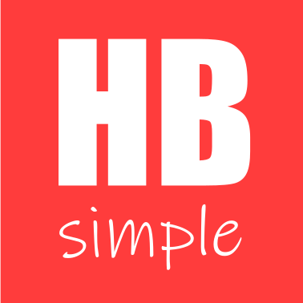
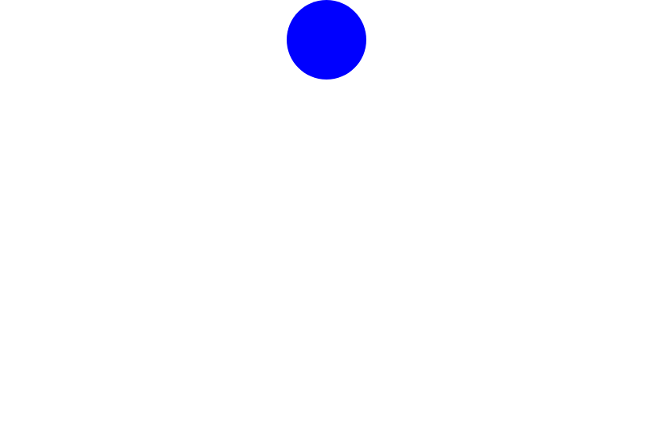
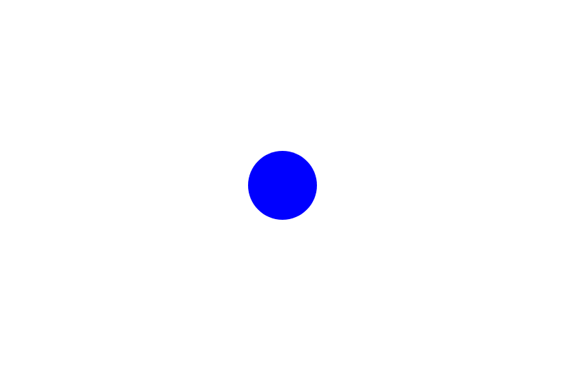

<p align="center">
  
</p>
<br>

<p align="center" style="text-align:center">
<h1>Heddaya Blocks Simple JS UI/UX Library - Developed By Mohamed Abdelsalam Ahmed Khalil Heddaya.</h1>
</p>

<details>
  <summary>Table of Contents</summary>
  <ol>
    <li>
      <a href="#about-the-project">About The Project</a>
      <ul>
        <li><a href="#built-with">Built With</a></li>
      </ul>
    </li>
    <li>
      <a href="#getting-started">Getting Started</a>
      <ul>
        <li><a href="#installation">Installation</a></li>
      </ul>
    </li>
    <li><a href="#usage">Usage</a></li>
    <li><a href="#roadmap">Roadmap</a></li>
    <li><a href="#contributing">Contributing</a></li>
    <li><a href="#license">License</a></li>
    <li><a href="#contact">Contact</a></li>
  </ol>
</details>


## About The Project

This Library Targeting Simplified UI/UX Development With A Neat System And Friendly Functions and No Prerequirities Or Any Additional Libraries Needed For Library To Work!

### Built With

Just Raw JS code using The "JS DOM" AKA "Javascript Document Object Model".

## Getting Started

<span style="font-family: mono-space; font-size: 24px;">

First, You Need To Know Some Basic Variables Of The System:

- `hbsmpls` object: This Object Is Holding The UI Elements Whole Data.

- `hbsmpl(<name>,<base>,<render>)` function: This Function Is The Responsible For Making New Elements In The hbsimple.js environment! (note: the environment of hbsimple.js is independent for the most ui actions taken from js side,
recommended to not use any additional libraries beside the hbsimple.js environment! ).
  - `<name>` Parameter For The Name Of The Element.
  - `<base>` Parameter For The Base Render Like Coordinates, Position Type And Non Precentile Scale, and the list below is the basic keys for the base object:
      - `hbpos: For Position Type Setting`.
      - `hbx: For X-axis Coordinate`.
      - `hby: For Y-axis Coordinate`.
      - `hbw: For Width Scale In Pixels`.
      - `hbh: For Height Scale In Pixels`.
      - `hbp: For Specifing The Parent Element Name in hbsimple.js Data (default: "hbroot")`.
      - `hblnbl: Its Boolean For Indicating The Element As Svg Element Or Not (default: false)`.
      - `hbtag: For Specifing The Tag Name Of The Element`.
      - `hbsrc: Its For The Source Informing Like Images URL`.
  - `<render>` Parameter For The Advanced Styling Render, you can basically just type the normal "JS DOM" style object keys names or choose the available shortcuts for some of the style object keys names, and some of the shortcuts is:
      - `hbbc: instead of "backgroundColor" key, It For Specifing The Background Color Of The Element`.
      - `hbwp: Its hbsimple.js Exclusive, It used for Width Scale in Precentage out of the parent element`.
      - `hbhp: Its hbsimple.js Exclusive, It used for Height Scale in Precentage out of the parent element`.
      - `hbin: For Specifing The Inner HTML content Of The Element`.
      - `hbbdt: instead of "borderTop" key, It For Specifing The Top Border Thickness Of The Element`.
      - `hbbdr: instead of "borderRight" key, It For Specifing The Right Border Thickness Of The Element`.
      - `hbbdl: instead of "borderLeft" key, It For Specifing The Left Border Thickness Of The Element`.
      - `hbbdb: instead of "borderBottom" key, It For Specifing The Bottom Border Thickness Of The Element`.
      - `hbbdc: instead of "borderColor" key, It For Specifing The Borders Color Of The Element`.
- `hbsmplr(<name>,<render>)` function: This For Later On Style Render For The Element After It Created.
  - `<name>` Parameter For The Name Of The Element.
  - `<render>` Parameter For The Styling Render Object For The Element.

</span>

## Installation

<span style="font-family: mono-space; font-size: 24px;">

You can Download It Using Git Clone in the command-line:

  `git clone https://github.com/MohamedHeddaya/hbsimple.git`

Or You Can Simply Download The Zip File:

  [The_Zip_File_For_Hbsimple_JS_Library](hbsimple.zip)

</span>

## Usage

That's Example For How To Create Your First Element In hbsimple:

```js
// Note That The Functions Not Have The Name hbsimple But Instead Abbreviated To hbsmpl With Omitting The "i" and The "e".

hbsmpl("hello",{hbx:0,hby:0,hbpos:"fixed",hbp:"hbroot",hbw:100,hbh:100},{hbbc:"red",borderRadius:"10px"});
```

<p align="center">
  
</p>

And If Want To Re-Style It Again Later After We Created It, We Can Do This:

```js
hbsmplr("hello",{borderRadius:"100%",hbbc:"blue"});

//This Will Make The Element From Red Curvy Square To Blue Full Circle.
```

<p align="center">
  
</p>

And To Align It Use Function `hbsmplal(<name>,<parent>,<align>)`:

```js

hbsmplal("hello","hbroot","ctp");

// "ctp" standfor "Center Top" to center the element in the top forehead of the parent element,
// and you can also choose from other aligns, like:

// "tplt" for "Top Left" align.

// "tprt" for "Top Right" align.

// "bmlt" for "Bottom Left" align.

// "bmrt" for "Bottom Right" align.

// "cbm" for "Center Bottom" align.

// "crt" for "Center Right" align.

// "clt" for "Center Left" align.

// "lt" for "Left" align.

// "tp" for "Top" align.

// "bm" for "Bottom" align.

// "rt" for "Right" align.

// "cxy" for Centering In Both X-axis And Y-axis Of The Element.

```

<p align="center">
  
</p>

And This With `"cxy"` align:

```js

hbsmplal("hello","hbroot","cxy");

```

<p align="center">
  
</p>
